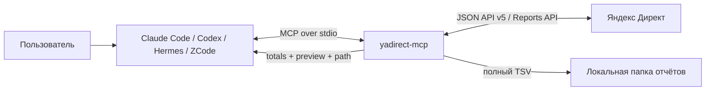

# Yandex Direct MCP Server — отчёты и безопасное создание кампаний для AI-агентов

[](https://www.python.org/)
[](https://modelcontextprotocol.io/)
[](https://yandex.ru/dev/direct/doc/ru/)
[](LICENSE)

**yadirect-mcp** — локальный MCP-сервер для Яндекс Директа, который подключает рекламную отчётность и защищённую настройку кампаний к Claude Code, OpenAI Codex, Hermes Agent, ZCode и другим MCP-совместимым AI-агентам.

Вместо десятков низкоуровневых методов API агент получает четыре понятных инструмента для аналитики и один опциональный инструмент для создания кампании. Большие отчёты сохраняются в TSV, а в контекст модели возвращаются только сводка и preview — это экономит токены и не обрезает данные.

> [!IMPORTANT]
> По умолчанию сервер работает в режиме `report`: все доступные инструменты только читают данные. Режим создания кампаний включается явно через `YD_MODE=campaign_setup`, требует preview и точного подтверждения и никогда автоматически не запускает показы.

## Для чего нужен yadirect-mcp

- Выгружать статистику Яндекс Директа естественным языком прямо из AI-агента.
- Получать список клиентов агентства и кампаний рекламодателя.
- Строить отчёты по показам, кликам, расходу, CTR, CPC, конверсиям и другим полям Reports API.
- Сохранять полные выгрузки на диск и читать их постранично без повторного расхода баллов API.
- Подготавливать текстово-графическую кампанию с группами, объявлениями и ключевыми фразами.
- Проверять план кампании до записи и создавать объекты только после явного согласия пользователя.
- Ограничивать доступ AI-агента белым списком клиентских логинов.

Проект полезен агентствам, PPC-специалистам, performance-маркетологам, аналитикам и разработчикам AI-автоматизаций для Яндекс Директа.

## Ключевые возможности

| Возможность | Как реализовано |
|---|---|
| Безопасный режим по умолчанию | В `YD_MODE=report` write-инструмент даже не регистрируется в MCP |
| Агентский токен, много клиентов | `client_login` передаётся в каждый клиентский вызов |
| Большие отчёты без переполнения контекста | Полный TSV сохраняется на диск, модель получает totals и первые строки |
| Корректные агрегаты | CTR, CPC и CR пересчитываются из суммарных метрик, а не складываются по строкам |
| Онлайн- и офлайн-отчёты | Поддержаны ответы `200`, очередь `201` и ожидание `202` с `retryIn` |
| Контроль очереди | Семафор на логин и лимит `YD_MAX_INFLIGHT` от 1 до 5 |
| Видимость баллов API | Заголовок `Units` добавляется к ответу инструмента |
| Защита от чужого кабинета | `YD_ALLOWED_LOGINS` ограничивает допустимые логины |
| Защищённая запись | Preview → точная confirmation-фраза → последовательное создание объектов |
| Без неожиданного запуска рекламы | Сервер не вызывает `resume`; созданная кампания остаётся неактивной |

## Как это работает



Сервер использует локальный stdio-транспорт. MCP-клиент сам запускает Python-процесс, передаёт ему переменные окружения и завершает его вместе с сессией. Логи пишутся только в `stderr`, потому что `stdout` зарезервирован протоколом MCP.

## Инструменты MCP

### `direct_list_clients`

Возвращает логины клиентов агентства, `ClientId`, название и валюту. Метод использует `agencyclients.get` без заголовка `Client-Login`.

Параметр:

- `limit` — максимум клиентов, по умолчанию `1000`.

### `direct_campaigns`

Возвращает ID, имя, тип, состояние и статус кампаний клиента.

Параметры:

- `client_login` — логин рекламодателя;
- `include_archived` — включить архивные кампании, по умолчанию `false`.

### `direct_report`

Формирует отчёт через Reports API, сохраняет TSV и возвращает путь, число строк, колонки, итоги и preview.

Основные параметры:

- `client_login` — логин рекламодателя;
- `date_from`, `date_to` — период в формате `YYYY-MM-DD`;
- `fields` — поля отчёта, например `Date`, `CampaignName`, `Impressions`, `Clicks`, `Cost`;
- `report_type` — тип отчёта, по умолчанию `CUSTOM_REPORT`;
- `goals` — ID целей Метрики;
- `attribution_models` — модели атрибуции;
- `filters` — фильтры Reports API;
- `order_by` — сортировка;
- `limit` — ограничение числа строк;
- `include_vat` — суммы с НДС или без него.

Поддерживаемые типы включают `CUSTOM_REPORT`, `ACCOUNT_PERFORMANCE_REPORT`, `CAMPAIGN_PERFORMANCE_REPORT`, `ADGROUP_PERFORMANCE_REPORT`, `AD_PERFORMANCE_REPORT`, `CRITERIA_PERFORMANCE_REPORT`, `SEARCH_QUERY_PERFORMANCE_REPORT` и `REACH_AND_FREQUENCY_PERFORMANCE_REPORT`.

Пример результата:

```json
{
  "path": "D:/yadirect-reports/client1_2026-06-01_2026-06-30_r_8f3a1c9d.tsv",
  "rows": 18234,
  "columns": ["Date", "CampaignName", "Impressions", "Clicks", "Cost"],
  "totals": {
    "Impressions": 1204331,
    "Clicks": 43012,
    "Cost": 1250430.5,
    "Ctr": 3.57,
    "AvgCpc": 29.07
  },
  "preview": [{"Date": "2026-06-01", "CampaignName": "Поиск | Москва"}],
  "preview_truncated": true,
  "units": {"spent": 12, "rest": 23695, "daily": 64000}
}
```

### `direct_read_report`

Читает ранее сохранённый TSV без нового обращения к API. Доступ разрешён только внутри `YD_OUT_DIR` и только для файлов `.tsv`.

Параметры:

- `path` — абсолютный путь из ответа `direct_report`;
- `offset` — первая строка, начиная с `0`;
- `limit` — размер страницы от `1` до `1000`.

### `direct_campaign_setup`

Доступен только при `YD_MODE=campaign_setup`. Создаёт одну новую `TextCampaign`, группы, текстовые объявления и ключевые фразы.

Параметры:

- `client_login` — логин рекламодателя;
- `campaign` — объект `CampaignAddItem` без `Id`;
- `ad_groups` — группы без `CampaignId`, с локальными массивами `Ads` и `Keywords`;
- `confirmation` — точная строка из `confirmation_required` после одобрения preview.

Первый вызов всегда выполняется без `confirmation` и ничего не записывает. После проверки плана пользователь явно подтверждает операцию, и агент повторяет тот же вызов с полученной строкой.

## Требования

- Windows 10/11, Linux или другая ОС с Python.
- Python 3.11 или новее.
- OAuth-токен Яндекс Директа с разрешением `direct:api`.
- Доступ приложения к API Яндекс Директа.
- MCP-клиент с поддержкой локального `stdio`.

Для агентского сценария нужен токен представителя агентства. Официальные инструкции: [регистрация приложения](https://yandex.ru/dev/direct/doc/ru/register), [получение OAuth-токена](https://yandex.ru/dev/direct/doc/ru/token) и [авторизационные токены](https://yandex.ru/dev/direct/doc/ru/concepts/auth-token).

> [!CAUTION]
> OAuth-токен даёт доступ к реальным данным и действиям пользователя Яндекс Директа. Не добавляйте токен в Git, README, issue, логи или скриншоты.

## Установка на Windows

### 1. Получите исходный код

Скачайте архив из GitHub Releases или клонируйте репозиторий:

```powershell
git clone <URL-ЭТОГО-РЕПОЗИТОРИЯ> yadirect-mcp
Set-Location yadirect-mcp
```

### 2. Создайте виртуальное окружение

```powershell
py -3.11 -m venv .venv
.\.venv\Scripts\python.exe -m pip install --upgrade pip
.\.venv\Scripts\python.exe -m pip install .
```

Если команда `py -3.11` недоступна, проверьте установленные версии через `py -0p` или используйте `python -m venv .venv`.

### 3. Подготовьте каталоги и секрет

Для текущей PowerShell-сессии:

```powershell
$env:YD_TOKEN = "y0_your_token"
$env:YD_OUT_DIR = "D:/yadirect-reports"
$env:YD_MODE = "report"
New-Item -ItemType Directory -Force $env:YD_OUT_DIR
```

В `cmd.exe`:

```bat
set YD_TOKEN=y0_your_token
set YD_OUT_DIR=D:\yadirect-reports
set YD_MODE=report
```

Файл `.env.example` — только документированный шаблон. Приложение намеренно не загружает `.env` автоматически: переменные передаёт оболочка или MCP-клиент.

## Установка на Linux

Для Debian/Ubuntu при необходимости установите Python и модуль `venv`:

```bash
sudo apt-get update
sudo apt-get install -y python3 python3-venv git
```

Затем установите сервер в изолированное окружение:

```bash
git clone <URL-ЭТОГО-РЕПОЗИТОРИЯ> yadirect-mcp
cd yadirect-mcp
python3 -m venv .venv
.venv/bin/python -m pip install --upgrade pip
.venv/bin/python -m pip install .
mkdir -p "$HOME/yadirect-reports"
```

Для текущей shell-сессии:

```bash
export YD_TOKEN='y0_your_token'
export YD_OUT_DIR="$HOME/yadirect-reports"
export YD_MODE='report'
```

Для сервера или CI храните токен в секрет-хранилище, а не в репозитории. Не запускайте MCP-процесс как публичный сетевой сервис: текущая реализация рассчитана на локальный `stdio`.

## Настройка переменных окружения

| Переменная | Обязательна | По умолчанию | Назначение |
|---|---:|---|---|
| `YD_TOKEN` | Да | — | OAuth-токен с доступом к Яндекс Директ API |
| `YD_AGENCY_LOGIN` | Нет | — | Логин агентства; информационная настройка |
| `YD_ALLOWED_LOGINS` | Нет | пусто | Разрешённые клиентские логины через запятую; пусто — любые |
| `YD_OUT_DIR` | Нет | `./out` | Каталог полных TSV-отчётов |
| `YD_MAX_INFLIGHT` | Нет | `4` | Одновременные офлайн-отчёты на логин, от `1` до `5` |
| `YD_INLINE_ROWS` | Нет | `30` | Строки preview в MCP-ответе, от `0` до `1000` |
| `YD_REPORT_DEADLINE` | Нет | `600` | Максимальное ожидание отчёта в секундах |
| `YD_SANDBOX` | Нет | `false` | Использовать sandbox API Яндекс Директа |
| `YD_LANG` | Нет | `ru` | Язык ошибок API: `ru` или `en` |
| `YD_MODE` | Нет | `report` | `report` или `campaign_setup` |

Рекомендуемая production-конфигурация начинается с `YD_MODE=report` и непустого `YD_ALLOWED_LOGINS`.

## Подключение к Claude Code

Claude Code запускает локальные MCP-серверы по stdio. Все параметры Claude должны стоять до имени сервера, а команда запуска — после `--`.

### Windows PowerShell

```powershell
claude mcp add --scope user --transport stdio `
  --env "YD_TOKEN=y0_your_token" `
  --env "YD_AGENCY_LOGIN=my-agency" `
  --env "YD_ALLOWED_LOGINS=client-1,client-2" `
  --env "YD_OUT_DIR=D:/yadirect-reports" `
  --env "YD_MODE=report" `
  yandex-direct -- `
  "D:/path/to/yadirect-mcp/.venv/Scripts/python.exe" -m yadirect_mcp
```

### Linux

```bash
claude mcp add --scope user --transport stdio \
  --env "YD_TOKEN=$YD_TOKEN" \
  --env "YD_AGENCY_LOGIN=my-agency" \
  --env "YD_ALLOWED_LOGINS=client-1,client-2" \
  --env "YD_OUT_DIR=$HOME/yadirect-reports" \
  --env "YD_MODE=report" \
  yandex-direct -- \
  /absolute/path/to/yadirect-mcp/.venv/bin/python -m yadirect_mcp
```

Проверка:

```bash
claude mcp list
claude mcp get yandex-direct
```

В интерактивной сессии выполните `/mcp`. Для командных отчётов, которые могут ждать очередь API, при необходимости добавьте в `.mcp.json` поле `"timeout": 660000`.

Официальная документация: [Connect Claude Code to tools via MCP](https://code.claude.com/docs/en/mcp).

## Подключение к OpenAI Codex

Codex CLI, IDE extension и Codex desktop используют общую MCP-конфигурацию `config.toml`. Пользовательский файл находится в `~/.codex/config.toml`; конфигурацию одного доверенного проекта можно хранить в `.codex/config.toml`.

### Windows

```toml
[mcp_servers.yandex-direct]
command = "D:/path/to/yadirect-mcp/.venv/Scripts/python.exe"
args = ["-m", "yadirect_mcp"]
cwd = "D:/path/to/yadirect-mcp"
startup_timeout_sec = 20
tool_timeout_sec = 660
default_tools_approval_mode = "writes"
env_vars = ["YD_TOKEN"]

[mcp_servers.yandex-direct.env]
YD_AGENCY_LOGIN = "my-agency"
YD_ALLOWED_LOGINS = "client-1,client-2"
YD_OUT_DIR = "D:/yadirect-reports"
YD_MODE = "report"
YD_LANG = "ru"
```

Перед запуском Codex задайте секрет в PowerShell:

```powershell
$env:YD_TOKEN = "y0_your_token"
codex
```

### Linux

```toml
[mcp_servers.yandex-direct]
command = "/absolute/path/to/yadirect-mcp/.venv/bin/python"
args = ["-m", "yadirect_mcp"]
cwd = "/absolute/path/to/yadirect-mcp"
startup_timeout_sec = 20
tool_timeout_sec = 660
default_tools_approval_mode = "writes"
env_vars = ["YD_TOKEN"]

[mcp_servers.yandex-direct.env]
YD_AGENCY_LOGIN = "my-agency"
YD_ALLOWED_LOGINS = "client-1,client-2"
YD_OUT_DIR = "/home/user/yadirect-reports"
YD_MODE = "report"
YD_LANG = "ru"
```

Проверьте сервер командой `codex mcp list`, а активные инструменты — командой `/mcp` внутри Codex. В desktop/IDE можно также открыть **Settings → MCP servers**, добавить STDIO-сервер и перезапустить клиент.

Официальная документация: [Model Context Protocol in Codex](https://learn.chatgpt.com/docs/extend/mcp).

## Подключение к Hermes Agent

Hermes читает MCP-настройки из `~/.hermes/config.yaml`. Для stdio-серверов Hermes передаёт только явно перечисленные переменные окружения, поэтому укажите все настройки в блоке `env`.

### Linux

```yaml
mcp_servers:
  yandex-direct:
    command: "/absolute/path/to/yadirect-mcp/.venv/bin/python"
    args: ["-m", "yadirect_mcp"]
    env:
      YD_TOKEN: "y0_your_token"
      YD_AGENCY_LOGIN: "my-agency"
      YD_ALLOWED_LOGINS: "client-1,client-2"
      YD_OUT_DIR: "/home/user/yadirect-reports"
      YD_MODE: "report"
      YD_LANG: "ru"
    timeout: 660
    connect_timeout: 20
    enabled: true
```

### Windows

```yaml
mcp_servers:
  yandex-direct:
    command: "D:/path/to/yadirect-mcp/.venv/Scripts/python.exe"
    args: ["-m", "yadirect_mcp"]
    env:
      YD_TOKEN: "y0_your_token"
      YD_OUT_DIR: "D:/yadirect-reports"
      YD_MODE: "report"
    timeout: 660
    connect_timeout: 20
    enabled: true
```

После изменения конфигурации запустите `hermes chat` или выполните `/reload-mcp` в активной сессии. Инструменты будут зарегистрированы с префиксом вида `mcp_yandex_direct_*`.

Ограничьте доступ к файлу конфигурации и не публикуйте его, если внутри находится токен. Официальная документация: [Hermes Agent — MCP](https://github.com/NousResearch/hermes-agent/blob/main/website/docs/user-guide/features/mcp.md).

## Подключение к ZCode

Откройте **Settings → MCP Servers → New MCP Server** и задайте:

1. Scope: `User` или `Workspace`.
2. Type: `stdio`.
3. Command: абсолютный путь к Python из `.venv`.
4. Arguments: `-m` и `yadirect_mcp` как два отдельных аргумента.
5. Environment variables: минимум `YD_TOKEN`, `YD_OUT_DIR` и `YD_MODE=report`.

В режиме **Full configuration** можно вставить JSON:

```json
{
  "mcpServers": {
    "yandex-direct": {
      "type": "stdio",
      "command": "D:/path/to/yadirect-mcp/.venv/Scripts/python.exe",
      "args": ["-m", "yadirect_mcp"],
      "env": {
        "YD_TOKEN": "y0_your_token",
        "YD_AGENCY_LOGIN": "my-agency",
        "YD_ALLOWED_LOGINS": "client-1,client-2",
        "YD_OUT_DIR": "D:/yadirect-reports",
        "YD_MODE": "report",
        "YD_LANG": "ru"
      }
    }
  }
}
```

ZCode также умеет импортировать MCP-серверы из конфигураций Claude Code, Codex CLI, OpenCode и generic `.agents`. Официальная документация: [ZCode MCP Servers](https://zcode.z.ai/en/docs/mcp-services).

## Другие MCP-клиенты

Cursor, Windsurf, Cline, Continue, OpenCode, VS Code и другие клиенты обычно принимают JSON-конфигурацию формата `mcpServers`. Названия меню и расположение файла отличаются, но параметры процесса одинаковы:

```json
{
  "mcpServers": {
    "yandex-direct": {
      "command": "/absolute/path/to/yadirect-mcp/.venv/bin/python",
      "args": ["-m", "yadirect_mcp"],
      "env": {
        "YD_TOKEN": "y0_your_token",
        "YD_OUT_DIR": "/absolute/path/to/yadirect-reports",
        "YD_MODE": "report"
      }
    }
  }
}
```

Универсальные правила:

- используйте абсолютный путь к Python из виртуального окружения;
- выбирайте транспорт `stdio`, не HTTP и не SSE;
- не добавляйте вывод в `stdout` между клиентом и сервером;
- передавайте токен через секреты или окружение;
- установите timeout вызова не меньше `YD_REPORT_DEADLINE + 60` секунд;
- после изменения режима перезапустите MCP-сервер, потому что набор инструментов определяется при старте.

## Первый запрос к агенту

После подключения начните с безопасной проверки:

```text
Используй yandex-direct. Покажи доступных клиентов агентства, ничего не изменяй.
```

Затем запросите отчёт:

```text
Выгрузи для client-login статистику кампаний за июнь 2026:
дата, кампания, показы, клики и расход. Суммы нужны с НДС.
Покажи итоги и 10 первых строк, полный файл не вставляй в чат.
```

Для дальнейшего чтения:

```text
Прочитай следующие 100 строк сохранённого отчёта через direct_read_report.
Не отправляй новый запрос в API.
```

## Создание кампании: безопасный сценарий

1. Остановите активный MCP-процесс.
2. Установите `YD_MODE=campaign_setup`.
3. Желательно задайте один или несколько логинов в `YD_ALLOWED_LOGINS`.
4. Перезапустите MCP-клиент и убедитесь, что появился `direct_campaign_setup`.
5. Попросите агента собрать недостающие данные и сформировать preview.
6. Проверьте бюджет, стратегию, регионы, даты, ссылки, тексты, ключевые фразы и минус-слова.
7. Явно подтвердите создание только после проверки.
8. После ответа проверьте `status`, созданные ID, warnings и errors.
9. Проверьте кампанию в интерфейсе Яндекс Директа. Сервер не запускает показы.

Пример безопасного запроса:

```text
Подготовь новую текстово-графическую кампанию для client-login.
Сначала задай вопросы о цели, географии, бюджете, сроках, стратегии,
счётчиках и целях Метрики, семантике, минус-словах и объявлениях.
Затем вызови direct_campaign_setup без confirmation и покажи полный preview.
Ничего не создавай без моего отдельного подтверждения.
```

Денежные поля JSON API при создании передаются в микроединицах: сумма в валюте × `1_000_000`. Входные поля используют официальный регистр API: `Name`, `StartDate`, `TextCampaign`, `RegionIds`, `TextAd`, `Keyword` и т. д.

Операция API не атомарна. Если дочерний этап завершился ошибкой, ответ сохраняет уже созданные ID. Не повторяйте весь запрос вслепую: это может создать дубликат кампании.

## Технические решения

### Стабильный `ReportName`

Имя отчёта — хеш спецификации. Оно остаётся одинаковым между попытками polling, иначе каждый повтор мог бы создать новый офлайн-отчёт. Разные поля и фильтры получают разные имена.

### Корректное ожидание Reports API

Сервер различает:

- `200` — отчёт готов;
- `201` — отчёт поставлен в очередь;
- `202` — отчёт ещё формируется;
- `400` — ошибка параметров или лимитов;
- `500` — ошибка сервера Яндекс Директа.

Для `201` и `202` сервер читает `retryIn`, повторяет идентичный запрос и контролирует общий deadline. Лимиты Reports API описаны в [официальной документации](https://yandex.ru/dev/direct/doc/ru/restrictions): одновременно в очереди может быть не больше пяти офлайн-отчётов на пользователя.

### Экономия контекста модели

Полный TSV не возвращается в MCP-ответе. `direct_report` отдаёт:

- абсолютный путь к файлу;
- количество строк и названия колонок;
- пересчитанные totals;
- ограниченный preview;
- информацию о баллах API.

Остальные строки читаются через `direct_read_report` без API-вызова.

## Ограничения

- Проект не является официальным продуктом Яндекса.
- В текущей версии нет Яндекс Метрики и Вордстата.
- Нет пакетной выгрузки сразу по всем логинам.
- Не создаются ЕПК, медийные и мобильные кампании.
- Не редактируются и не удаляются существующие объекты.
- Не выполняются `resume`, автоматический запуск показов и rollback.
- Сервер предоставляет локальный stdio-транспорт, а не удалённый HTTP endpoint.

## Диагностика

### MCP-клиент не видит сервер

1. Убедитесь, что путь в `command` абсолютный и файл существует.
2. Выполните `"<python>" -c "import yadirect_mcp; print('ok')"` в той же среде.
3. Проверьте наличие `YD_TOKEN` именно в окружении MCP-процесса.
4. Проверьте, что аргументы переданы как `-m`, `yadirect_mcp`.
5. Перезапустите клиент после изменения конфигурации.

### `YD_TOKEN не задан`

Сервер не получил токен. `.env` автоматически не читается. Добавьте `YD_TOKEN` в `env` конфигурации MCP или экспортируйте переменную до запуска клиента.

### Отчёт завершается по timeout клиента

Увеличьте timeout инструмента. Рекомендуемое значение — `YD_REPORT_DEADLINE + 60` секунд. Для стандартного deadline `600` используйте `660` секунд или `660000` миллисекунд — в зависимости от формата клиента.

### Логин заблокирован

Если ответ содержит `Логин ... не разрешён`, добавьте точный логин в `YD_ALLOWED_LOGINS` через запятую или исправьте опечатку. Для production не рекомендуется отключать whitelist без необходимости.

### Ошибка Яндекс Директа

Ответ инструмента содержит `error`, а для `DirectError` также `error_code` и `request_id`. Сохраните `request_id` для обращения в поддержку и проверьте совместимость выбранных полей, типа отчёта и фильтров.

## Разработка

Установите dev-зависимости:

```bash
python -m venv .venv
python -m pip install -e ".[dev]"
```

Запустите проверки:

```bash
python -m ruff check .
python -m pytest -q
python -m build
python -m twine check dist/*
```

Тесты покрывают polling `201 → 202 → 200`, стабильность `ReportName`, заголовки API, обработку `400`, пересчёт итогов, whitelist, проверку конфигурации, регистрацию read/write-инструментов по режиму, безопасный preview, валидацию родительских ID, передачу созданных ID и частичные ошибки.

Правила участия описаны в [CONTRIBUTING.md](CONTRIBUTING.md), выпуск версии — в [RELEASING.md](RELEASING.md), политика безопасности — в [SECURITY.md](SECURITY.md).

## Roadmap

- [ ] Яндекс Метрика: выгрузка на диск плюс компактная сводка.
- [ ] Вордстат через Yandex Cloud Search API.
- [ ] `direct_report_batch` для нескольких логинов с общим контролем очереди.
- [ ] Дисковый кеш закрытых периодов с TTL по дате.
- [ ] Экспорт Parquet для BI и аналитических пайплайнов.
- [ ] Опциональный удалённый Streamable HTTP transport с отдельной аутентификацией.

## Лицензия

Проект распространяется по лицензии [MIT](LICENSE).

Названия Яндекс, Яндекс Директ, Claude, Codex, Hermes и ZCode принадлежат соответствующим правообладателям. Этот независимый проект не аффилирован с Яндексом, Anthropic, OpenAI, Nous Research или Zhipu AI.

---

**Ключевые слова:** Яндекс Директ MCP, Yandex Direct MCP server, API Яндекс Директа, Claude Code MCP, OpenAI Codex MCP, Hermes Agent MCP, ZCode MCP, AI-агент для контекстной рекламы, автоматизация PPC, отчёты Яндекс Директ, управление рекламными кампаниями.
