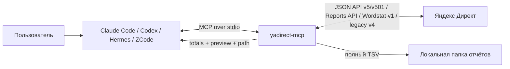

# Yandex Direct MCP Server — отчёты, аудит и безопасная настройка кампаний

## 2026-09-18 — стандартный стартовый тест

По правилу пользователя готовим **Поиск + РСЯ**, для интернет-магазинов —
**товарную кампанию + Поиск**. Ориентир — **30 000 RUB в месяц на весь новый план**.
Этого достаточно для стандартного теста по агентскому правилу; сумма сама по себе
не основание сокращать его до одного канала. Полнее покрываем релевантные
направления, семантику и креативные гипотезы в общем лимите. Явное задание клиента
имеет приоритет. Правило одинаково для new/established; история влияет на стратегию
и доли бюджета. НДС и доли кампаний указываются явно, Карты входят в общий лимит.

`direct_policy.planning_defaults` содержит текущие рекомендации отдельно от
зафиксированных policy. Старые планы, профили и их хеши не меняются. Прежний
ориентир по 5 000 в неделю на каждый канал заменён месячным общим бюджетом.
Для товарной ЕПК добавлены `ecommerce_new_v2` / `ecommerce_established_v2` и
`channels.product`: ShoppingAd и ListingAd, фильтры, товарная галерея + сети
с общим бюджетом. Отдельный Поиск остаётся отдельной кампанией. URL фида можно
передать прямо в задании. `direct_product_source` проверяет источник,
`direct_feed_create` создаёт URL-фид через защищённый preview/apply.
Если фида нет, но на сайте есть товарная разметка, источник по сайту сначала
создаётся в интерфейсе Директа; доступный через API FeedId затем используется
в плане. API не создаёт источник SITE. До и после создания проверяются фид,
объявления и результат обработки; фактические товарные карточки проверяются
в интерфейсе. [Полный контракт и пример](src/yadirect_mcp/knowledge/product-campaigns.md).

## 2026-09-18 — профили бизнеса и истории

Добавлены шесть явных `policy_name`: `services_b2b_new_v1`,
`services_b2b_established_v1`, `local_business_new_v1`,
`local_business_established_v1`, `ecommerce_new_v1`, `ecommerce_established_v1`.
`direct_policy` перечисляет доступные профили. Услуги/B2B ориентируются на
бизнес-обращения, локальный профиль требует офис/Карты/контакты, e-commerce —
проверку каталога и покупки. Структура и требования к истории различаются.

Без истории выбирается максимум кликов. При проверенном измерении и достаточной
истории конкретной цели/канала/географии — максимум конверсий; критерии профиля:
от 7 дней, окончание не старше 30 дней, в среднем от 10 конверсий в неделю.
Источник и результат проверки специалистом передаются в `profile_context`.
MCP проверяет декларацию, но не удостоверяет содержимое источника статистики.
Явный максимум кликов сохраняется. Причины выбора видны в `profile_decisions`.

Для бизнес-профилей обязателен общий client_budget только на кампании плана.
Общий blacklist площадок не подставляется; исключения, ограничение расписания
и включение автотекстов требуют явного обоснования. UTM и защитные проверки сохранены.
Товарные форматы доступны в дополнительных e-commerce v2 выше; CRR не добавлен.

`agency_default_v1` зафиксирован на 1.12.0 и остаётся профилем совместимости
для bundle без policy_name. Прежние планы и SHA-256 воспроизводятся без миграции.
Профиль, версия, снимок правил и история входят в хеш нового плана; readback
использует тот же профиль. [Контракт и примеры](src/yadirect_mcp/knowledge/policy-profiles.md).

## 2026-09-18 — измерение и проверки, политика 1.12.0

Новые планы используют `tracking_profile: "utm_v1"`: стандартные UTM вместе
с прежними BI-параметрами. Значения: `utm_source=yandex`, `utm_medium=cpc`,
`utm_campaign={campaign_id}`, `utm_content={ad_id}`, `utm_term={phrase_id}`.
Поисковая фраза отдельно сохраняется в `key={keyword}`. Профиль задаётся в
кампанийном `TrackingParams`; эффективные основные и быстрые ссылки проходят
проверку с метками. Явный `regulation_v1` поддержан для совместимости, аудит
распознаёт оба профиля. Уже созданные кампании автоматически не обновляются.

Общий `client_budget` ограничивает **только кампании создаваемого плана**, включая
все варианты каналов. Работавшие ранее кампании в сумму не входят. Агент явно
заполняет общий лимит и распределяет `weekly_budget` по кампаниям; компилятор
не перераспределяет деньги. Пример для пары Поиск/РСЯ, когда явно согласованы
30 000 RUB в месяц **без НДС**: недельные доли 3 500 и 3 400 RUB укладываются
в средний недельный лимит 6 923,076923 RUB. Это пример распределения, не фиксированная пропорция:

```json
{
  "client_budget": {
    "amount": 30000,
    "period": "monthly",
    "currency": "RUB",
    "includes_vat": false
  },
  "weekly_budget": {"search": 3500, "network": 3400},
  "tracking_profile": "utm_v1",
  "settings": {"ALTERNATIVE_TEXTS_ENABLED": false}
}
```

Это фрагмент bundle. `amount` задан в обычных единицах валюты. Для суммы с НДС
нужны `includes_vat: true` и явный `vat_percent`; ставка не угадывается. При
`period: "monthly"` недельный лимит без НДС равен месячной сумме без НДС × 12/52
с округлением вниз до микроединицы. Это средний недельный эквивалент, **не жёсткий
лимит расхода за календарный месяц**. Превышение суммы, подмена расчётного лимита
и несовпадение валюты с кабинетом блокируют запись. Итог виден в
`summary.client_budget`; после записи проверяются фактические бюджеты новых
кампаний. Старые входные данные без `client_budget` поддержаны со статусом
`not_configured`, без заявления о проверенном общем лимите.

Автотексты задаются явно: по умолчанию `ALTERNATIVE_TEXTS_ENABLED=NO`.
Осознанное `settings.ALTERNATIVE_TEXTS_ENABLED: true` включает их и меняет хеш
плана. Фактическое значение сверяется после создания.

Для каждого используемого `BusinessId` новый bundle требует ровно один
ожидаемый профиль, например:

```json
{
  "business_profiles": [{
    "business_id": "123456789",
    "phone": "+7 (495) 123-45-67",
    "address": "Москва, Тестовая улица, 1",
    "has_office": true
  }]
}
```

Контакты берутся из согласованных данных клиента. Чтение API используется для
сверки, а не как замена согласованию. До записи и при независимом readback
проверяются `IsPublished`, `Phone`, `Address`, `HasOffice`. Формат телефона,
регистр и пробелы адреса нормализуются; смысловые различия адресов автоматически
не приравниваются. Для организации без офиса допустим `address: null`.
Проверка относится к профилю организации объявления, не доказывает привязку
организации на другом уровне или наличие телефона на посадочной.

В `maximum_conversion_rate` поддержан `strategy.goal_id: 13` — выбор ключевых
целей кампании. В `priority_goals` должна быть хотя бы одна реальная цель,
отличная от системной 12; 13 в этот массив передавать нельзя. Live preflight
проверяет реальные ID целей по каталогу, readback сверяет `GoalId` стратегии.
В отчётах 13 раскрывается в приоритетные цели и не считается самостоятельным
лидом. Выбор только системной цели 12 не проходит такую проверку.

План, SHA-256, техническое подтверждение, elicitation и запрет автоматического
запуска сохранены. Чтобы уже работающий MCP загрузил изменения кода, его нужно
перезаподключить; `direct_runtime` показывает расхождение загруженных файлов.

## 2026-09-17 — проверка ссылок больших планов

Конечные URL проверяются пакетами по 150, до 1000 на каждый тип устройства.
Каждый ответ сохраняется; отсутствующие, ошибочные и оставшиеся за общим
пределом ссылки по-прежнему блокируют запись. Сетевые ограничения не меняются.

## 2026-09-17 — лимит проверки организаций

Проверка профилей организаций использует страницы и пакеты по 1000 объектов,
как требует Businesses.get. Проверки полноты выборки и опубликованности
профиля сохранены.

Readback учитывает нормализацию регистра `ExcludedSites` на стороне Директа;
отсутствующие или лишние площадки по-прежнему блокируют проверку.

## Подготовка и применение после аудита 11.09.2026

Недостающие сведения, включая бюджет, выяснить в начале задачи. Затем
самостоятельно подготовить и проверить полный план и назначение отчёта.
Перед записью MCP-клиент запрашивает согласие через elicitation на конкретный
логин и полный хеш плана. `confirmation` остаётся техническим одноразовым токеном
целостности и сам по себе не разрешает запись. Решение, хеш, время и имя клиента
сохраняются в журнале. Участие человека обеспечивает доверенный интерфейс клиента;
сервер фиксирует `client_attested`, а не удостоверенную личность человека.

Если форма не появилась, ответ `decline`/`cancel` не доказывает отказ человека:
клиент может отклонить запрос автоматически. MCP возвращает отдельный `error_code`,
имя/версию клиента и доступность form elicitation. Отмена не расходует технический
токен; повтор требует нового ответа интерфейса, а срок 30 минут продолжает действовать.
Одновременно открыть два запроса с одним токеном нельзя; после согласия токен
расходуется один раз с повторной проверкой логина, полного хеша и срока.

В Codex разрешите показ MCP-форм: `approval_policy.granular.mcp_elicitations=true`.
Настройку задают в локальной `.codex/config.toml`, которая не включается в Git и
дистрибутив. Она не означает автоматического согласия и не меняет песочницу.
Проект должен быть доверенным; выбранная в приложении политика `never`
может переопределять файл. После перезапуска проверьте эффективную политику задачи.
Справка: [настройки Codex](https://learn.chatgpt.com/docs/config-file/config-reference).

Codex 0.154 может вернуть `cancel` даже при `on-request`, если типизированный
парсер клиента отвергает JSON Schema формы. Подтверждённая ошибка в журнале:
`failed to parse typed MCP elicitation schema: unknown field title`.
Форма MCP удаляет только необязательный корневой `title`, автоматически добавленный
Pydantic; обязательное поле `approve`, подпись, валидация ответа и проверка хеша
сохранены. После обновления кода MCP-процесс нужно перезапустить. Наличие формы
и успешное подтверждение проверяются отдельно от unit/stdio-тестов.

Запуск и возобновление показов требуют отдельной явной команды пользователя.
Preview, live preflight, независимый readback, резервные копии и проверки
публикации сохраняются. `BLOCK`, неполные выборки и дубли останавливают запись.
Разрешения среды исполнения и границы доступа это правило не изменяет.

[](https://www.python.org/)
[](https://modelcontextprotocol.io/)
[](https://yandex.ru/dev/direct/doc/ru/)
[](https://github.com/Lermont/yamcp/actions/workflows/ci.yml)
[](LICENSE)

**yadirect-mcp** — локальный MCP-сервер для Яндекс Директа, который подключает рекламную отчётность и защищённую настройку кампаний к Claude Code, OpenAI Codex, Hermes Agent, ZCode и другим MCP-совместимым AI-агентам.

Вместо десятков низкоуровневых методов API агент получает компактные инструменты для аналитики, аудита и опциональной настройки. Инструмент здесь соответствует задаче, а не методу API: например, `direct_campaign_audit` читает настройки кампаний и посадочные страницы, применяет версионированную агентскую политику и сохраняет воспроизводимый JSON. Большие отчёты сохраняются в TSV, а в контекст модели возвращаются только сводка и preview — это экономит токены и не обрезает данные.

> [!IMPORTANT]
> По умолчанию сервер работает в режиме `report`: все доступные инструменты только читают данные. Режим создания кампаний включается явно через `YD_MODE=campaign_setup`, требует preview и точного подтверждения и никогда автоматически не запускает показы.

## Для чего нужен yadirect-mcp

- Выгружать статистику Яндекс Директа естественным языком прямо из AI-агента.
- Получать список клиентов агентства и кампаний рекламодателя.
- Читать полные настройки TextCampaign и UnifiedCampaign через API v501.
- Проверять кампании по машиночитаемому регламенту со статусами PASS/WARNING/BLOCK/MANUAL.
- Строить отчёты по показам, кликам, расходу, CTR, CPC, конверсиям и другим полям Reports API.
- Читать настройки, которых в отчётах нет: корректировки ставок, условия ретаргетинга, общие наборы минус-фраз.
- Видеть, куда ведёт реклама: посадочные страницы объявлений, их UTM-разметку и заполненность дополнений.
- Проверять коды регионов до того, как они уедут в кампанию или в запрос частотности.
- Сохранять полные выгрузки на диск и читать их постранично без повторного расхода баллов API.
- Компилировать отдельные нативные UnifiedCampaign для Поиска, РСЯ и условных Карт.
- Делать live preflight, связывать одноразовое подтверждение с SHA-256 плана и
  независимо перечитывать созданные объекты.
- Ограничивать доступ AI-агента белым списком клиентских логинов.

Проект полезен агентствам, PPC-специалистам, performance-маркетологам, аналитикам и разработчикам AI-автоматизаций для Яндекс Директа.

## Ключевые возможности

| Возможность | Как реализовано |
|---|---|
| Безопасный режим по умолчанию | В `YD_MODE=report` write-инструмент даже не регистрируется в MCP |
| Версионированный регламент | `direct_policy` отдаёт `agency_default_v1`, общий для аудита и компилятора |
| Read-only аудит кампаний | `direct_campaign_audit` проверяет структуру, бюджет, стратегию, разметку и ограничения и сохраняет JSON |
| Полные настройки ЕПК | `direct_campaign_settings` читает стратегии, места показов, цели и TrackingParams через JSON API v501 |
| Агентский токен, много клиентов | `client_login` передаётся в каждый клиентский вызов |
| Большие отчёты без переполнения контекста | Полный TSV сохраняется на диск, модель получает totals и первые строки |
| Частотность Вордстата | `direct_wordstat` собирает спрос по фразам, пишет полный список на диск и отдаёт сводку |
| Настройки мимо отчётов | `direct_account_settings` читает корректировки, ретаргетинг и общие минус-фразы; секции независимы |
| Посадочные страницы и UTM | `direct_ads` отдаёт `Href`, которого нет ни в одном типе отчёта, и сводку по уникальным URL |
| Гео без угадывания | `direct_regions` ищет код по названию и проверяет готовые коды, которые Директ принимает молча |
| Корректные агрегаты | CTR, CPC и CR пересчитываются из суммарных метрик, а не складываются по строкам |
| Онлайн- и офлайн-отчёты | Поддержаны ответы `200`, очередь `201` и ожидание `202` с `retryIn` |
| Контроль очереди | Семафор на логин и лимит `YD_MAX_INFLIGHT` от 1 до 5 |
| Видимость баллов API | Заголовок `Units` добавляется к ответу инструмента |
| Защита от чужого кабинета | `YD_ALLOWED_LOGINS` ограничивает допустимые логины |
| Защищённая запись | План → live preflight → одноразовая confirmation, связанная с хешем → elicitation → фоновый v501 apply |
| Независимая приёмка | После записи сервер перечитывает кампании, группы, объявления и фразы и повторяет policy-аудит |
| Без неожиданного запуска рекламы | Сервер не вызывает `resume`; readback блокирует состояние `ON` |

## Как это работает



Сервер использует локальный stdio-транспорт. MCP-клиент сам запускает Python-процесс, передаёт ему переменные окружения и завершает его вместе с сессией. Логи пишутся только в `stderr`, потому что `stdout` зарезервирован протоколом MCP.

## Инструменты MCP

### `direct_policy`

Возвращает выбранную по policy_name политику (по умолчанию `agency_default_v1`),
список available_profiles и текущие planning_defaults: состав стартового теста,
общий бюджет, приоритет явного задания клиента и границы автоматизации.
Рекомендации планирования не меняют зафиксированные снимки policy.
В кабинет не обращается.

### `direct_campaign_plan`

Локальный компилятор `direct_campaign_bundle_v1`; сохраняет JSON, кабинет не меняет. Формирует одну или несколько
отдельных UnifiedCampaign Поиска, РСЯ и Карт по явно выбранным каналам;
стандартный тест услуг/B2B и локального бизнеса — Поиск + РСЯ.
Карты обязательны при office=true в legacy и в локальном профиле;
в услугах/e-commerce — по необходимости при наличии офиса.
Подбирает минус-фразы по бизнесу, исключения площадок по профилю, кампанийный tracking и
автотаргетинг. Возвращает `findings`, `ready`, точные v501 payload и `plan_hash`.

Бюджет задаётся числом для всех каналов или в варианте канала. Диапазон
2 000–5 000 RUB — рекомендация только legacy-профиля; бизнес-профили проверяют
общий client_budget. `budget_approved` сохранён для совместимости. Значение
канала может быть массивом явных вариантов.
 Если у нескольких
кампаний одинаковы группы, объявления и ключевые фразы, используйте компактную
пару `campaign_template` + `campaign_variants`: контент передаётся один раз, а
варианты задают только `channel`, `name`/`name_suffix`, `region_ids`,
`weekly_budget`, `budget_approved` и `strategy`. Компилятор разворачивает шаблон
до всех проверок и хеширования; изменение контента внутри варианта блокируется.
Если бюджет не задан, используется `YD_DEFAULT_WEEKLY_BUDGET` как технический
fallback. В новых планах доли задаются явно в пределах общего client_budget.

```jsonc
{
  "campaign_template": {
    "groups": [/* полные общие группы с ключами и объявлениями */]
  },
  "campaign_variants": [
    {"channel": "search", "name_suffix": "РФ", "region_ids": [225]},
    {"channel": "search", "name_suffix": "СНГ", "region_ids": [149, 168, 159]}
  ]
}
```

Preview содержит `api_units_estimate` — расчёт успешной write-фазы по тарифам
Директа. Ответы write-инструментов содержат `units_usage`: сумму и детализацию
фактических заголовков `Units` по всем API-запросам текущей операции.

`age_min` обязателен: значение `18` компилирует исключение `AGE_0_17` через
`bidmodifiers.add`. По умолчанию и при `schedule: "always_on"` используется
стандартное «Круглосуточно»: `TimeTargeting` при создании не передаётся.
Объект расписания со всеми днями, часами и ставкой 100% сворачивается в тот же
режим. Ограниченное расписание передаётся явно в формате строк API.
Автотаргетинг создаётся с полным `AutotargetingSettings`; безопасный профиль
включает только Exact и Narrow, исключает расширенные категории и бренды
конкурентов. Выбранные цели проверяются по живому каталогу; если каталога ещё
нет, требуется отдельное осознанное `allow_unverified_goals=true`.

География задаётся регионами на уровне групп; MCP проверяет их корректность
и подтверждение `regions_verified`.

Для `maximum_clicks` счётчик и бизнес-цели необязательны: `counter_ids` и
`priority_goals` можно опустить или передать пустыми массивами. Компилятор
не отправляет пустые `CounterIds`/`PriorityGoals` и не подставляет фиктивную
цель. Если цели не выбраны, `goals_reviewed`, каталог целей и
`allow_unverified_goals` не требуются. Счётчик без выбранных целей допустим.
Если бизнес-цели указаны, сохраняются проверка счётчика, ручное подтверждение
целей и live-проверка каталога. Для `maximum_conversion_rate` по-прежнему
обязательны счётчик и явный `goal_id` из `priority_goals` либо селектор 13
при наличии хотя бы одной приоритетной цели кроме системной 12.

Основание: [UnifiedCampaign.add](https://yandex.ru/dev/direct/doc/ru/campaigns/add-unified-campaign):
`CounterIds` необязателен, `WB_MAXIMUM_CLICKS` не требует `GoalId` или
`PriorityGoals`. Проверено 09.09.2026.

Канал принимает стратегию `maximum_clicks` либо
`{"type":"maximum_conversion_rate","goal_id":77}`. Во втором случае goal ID
обязан входить в `priority_goals`; средняя CPA не задаётся.

Минус-фразы выбираются через `negative_keyword_policy`. По умолчанию `custom`
не добавляет общий список. Доступны небольшие профили `rental`, `education`,
`toys`; старый снимок выбирается только явно как `legacy_reviewed`.

```json
{
  "negative_keyword_policy": {
    "profile": "rental",
    "business_terms": ["прокат инструмента", "бесплатная доставка"],
    "additions": [{"phrase": "скачать чертеж", "reason": "Не предлагаем чертежи"}],
    "exclusions": [{"phrase": "вакансия", "reason": "Для этого клиента согласовано исключение"}]
  }
}
```

`negative_keyword_selection` в preview объясняет, какие фразы выбраны и исключены.
В `negative_keyword_policy.search_queries` можно передать строки из отчёта
по запросам, в `landing_texts` — проверенные выдержки посадочной. Они участвуют
в поиске пересечений и сохраняются как переданный контекст (`provided_in_bundle`);
локальный компилятор сам не выгружает запросы и не открывает сайт.
Явное дополнение, пересекающееся с предложением/ключами, требует рассмотрения
через `search.negative_context_conflict`. Отсутствие фразы из общего снимка
не блокирует аудит. Проверка эвристическая: ассортимент, посадочную и реальные
запросы нужно оценить по существу; профиль не является требованием Яндекса.

Объявления компилируются только в актуальный `ResponsiveAd`: обязательны
нативные массивы из 3–7 уникальных `titles` и ровно 3 уникальных `texts`.
В новой группе допускаются 1–3 объявления; одно полное объявление — стартовая
рекомендация. Четвёртое блокируется до API, в том числе в сохранённом старом плане.
Сокращённые поля `title`/`title2`/`text` preflight не принимает. Требуется `href`
или `business_id`; `display_url_path` и `sitelink_set_id` допустимы только при
наличии `href`. Имена, минус-фразы, тексты, ссылки и размеры массивов проверяются
локально до вызова API.

Быстрые ссылки: минимум **4**, предпочтительно **8** полезных ссылок с описаниями.
Создавайте один общий набор через `direct_ad_assets_create`. Его `sitelink_set_id`
можно задать один раз в bundle, `campaign_template`, канале/варианте кампании
или группе. Приоритет: объявление → группа → канал/вариант → bundle.
Компилятор подключит этот же ID к каждому объявлению; повторно создавать набор
не нужно. Это переиспользование набора, а не кампанийное наследование интерфейса
Директа: в API поле `SitelinkSetId` находится в объявлении. Индивидуальные наборы
нужны только для действительно разных предложений или посадочных.

Перед созданием и заменой набора MCP читает каждый уникальный ID через
`sitelinks.get` и блокирует наборы вне 4–8. Аудит проверяет фактическое количество:
меньше 4 — `BLOCK`, 4–7 — рекомендация расширить до 8, 8 — `PASS`.
Если API не вернул набор или количество, результат — `MANUAL`, не ложный `PASS`;
при создании непроверенный набор блокирует запись. Наследование из интерфейса
нужно отдельно проверить в Директе, не заменяя его вслепую.

### Структура и источники семантики — политика 1.6.0

Новые типизированные планы требуют `semantic_plan`: направления бизнеса,
реестр источников с датами и географией, результат разбора доступной истории и
кандидаты с решениями включить/исключить/проверить. Каждая группа содержит
`semantic`: намерение, предложение, основную посадочную, причину разделения,
брендовый сегмент и ссылки на выбранных кандидатов. Источники модели — гипотезы;
наличие ссылки не выдаётся за проверку её содержания.

Ориентиры небольшого проекта: Поиск 3–10 групп и 10–30 ключей на группу, РСЯ
2–5 групп и 5–15 тематических ключей. Отклонение допустимо с объяснением
(`group_count_reason`, `keyword_count_reason`); для каталога есть отдельный профиль
с обоснованием. Технические пределы 1000 групп, 200 ключей и лимиты строки
проверяются до записи. Старт с одного объявления; дополнительные требуют
различающихся `hypothesis`. Рекомендуется 7 полезных заголовков и 3 текста.

`summary.keywords` считает обычные ключи, `autotargeting` — автотаргетинги,
`criteria` — все записи Keywords.add, учитываемые в стоимости API. Реестр и
обоснования входят в хеш подтверждаемого плана. Старый bundle без новых данных
можно просмотреть как незавершённый план, но применить его нельзя.

Wordstat проверяется по группам, с раздельными нулевой частотностью, пустым
результатом и отсутствующими данными. Фильтр подсказок не скрывает частотность
запрошенной фразы. TSV сопровождается `.meta.json` с временем, географией и SHA-256.

Полная схема, пример и границы проверок:
[`direct://kb/structure-semantics`](src/yadirect_mcp/knowledge/structure-semantics.md).

### `direct_campaign_apply`

Доступен при `YD_MODE=campaign_setup`. Без `confirmation` запускает preflight
и возвращает `job_id`; состояние читается через `direct_write_job`. По завершении
возвращается `preview` с техническим токеном на 30 минут либо `blocked` с находками.
Проверяются регионы, дубли, доступность дополнений, валюта и минимальный бюджет,
цели, ссылки и Wordstat. Успешные дорогие проверки кешируются на 15 минут по логину
и хешу плана; при apply быстрые проверки кабинета выполняются заново.

Повторный вызов с неизменным bundle и токеном требует согласия в MCP elicitation.
Запись выполняется в фоне под блокировкой логина; каждый запрос и ответ сохраняются
в `out/jobs`. Отмена ожидания не отменяет операцию. После остановки процесса работа
автоматически не возобновляется. При неизвестном исходе выполняется сверочное чтение,
а блокировка остаётся до проверки оператором. Повтор того же хеша после отправленной
записи возвращает прежнюю операцию и не создаёт копии. Ошибка preflight до первой записи
допускает новую попытку с сохранением прежнего журнала.

`direct_write_job(client_login, job_id)` возвращает состояние, результат и путь
журнала. `complete_unverified` означает расхождение readback, `partial` — частичную
запись, `uncertain=true` — неизвестный исход хотя бы одного запроса. Нельзя повторять
такую запись по одному лишь списку кандидатов сверочного чтения.

По итогам низкоуровневый обработчик формирует вспомогательную выгрузку настройки
`<YD_OUT_DIR>/<client_login>/create/index.html`: фактические кампании, группы,
география, автотаргетинг, ключевые фразы и объявления. Технический readback
остаётся в отдельном JSON-аудите. При явно настроенном назначении эта выгрузка
публикуется на `<public_base_url>/<client_login>/create/` с backup, атомарной
заменой и проверкой SHA-256 (`creation_report.verified=true`).

**Клиент получает единый отчёт Media Targeting по адресу
`https://bi-data.ru/elama/<client_login>/`.** Он создаётся при настройке и
затем дополняется статистикой. Раздел «Настройка» и предыдущие периоды
сохраняются; в левом меню — «Настройка» и «Статистика». Контакты футера включают
Telegram `@SergeyMushtuk` и MAX `+79099994402`.

Это обязательное правило агента в обоих режимах MCP, записанное в
`direct_policy.reporting.client_report` и `direct://kb/client-report`.
Автоматическая выгрузка `/create/` пока не объединяет статистику; после неё
агент явно собирает или обновляет канонический документ из сохранённой модели.
Шаблон и сборщик: `templates/client-report`. Это же правило действует при
работе через отдельный скрипт SDK/API и через интерфейс.

Перед обновлением прочитать текущий отчёт и данные, сохранить backup. При
настроенной публикации обновить тот же `index.html` атомарно; проверить HTTP
200, SHA-256, разделы и сохранность истории в браузере. Локальный preview не
заменяет публикацию. В итоговом ответе дать каноническую ссылку. Восстановление
пропущенного отчёта выполняется по существующим ID, без повторного создания
кампаний. Переменные `YD_CREATE_REPORT_*` из MCP не обязательно доступны
произвольному shell-процессу: параметры назначения передаются явно.

### `direct_campaign_repair`

Защищённо обновляет явно переданные части существующих ЕПК: минус-фразы,
приоритетные цели, отдельные поля `ResponsiveAd` и настройки автотаргетинга.
ID объектов и дополнений принимаются числами либо десятичными строками;
дубли и некорректные ID блокируются до записи.

Отсутствующее поле объявления сохраняет прежнее значение. `display_url_path: null`
и `sitelink_set_id: null` очищают соответствующие поля; `ad_extension_ids: []`
удаляет уточнения. Массивы заголовков, текстов и изображений при передаче заменяются
полностью и должны проходить валидацию. `href: null` допустим только если итоговое
объявление имеет доступную привязку организации и не содержит отображаемого пути.
Семантика пропущенных и очищаемых полей соответствует
[Ads.update](https://yandex.ru/dev/direct/doc/ru/ads/update).

До выдачи preview-токена выполняется live preflight: принадлежность и полнота
объектов, тип объявлений, дополнения и конечные URL основных/быстрых ссылок
с наследуемыми TrackingParams для desktop/mobile. Непроверенные URL блокируют
preview. Связанный с логином и хешем плана снимок сохраняется в артефакте и гранте.
После согласия, перед первой записью, проверки повторяются; изменение исходных
настроек требует нового preview. Отказ не разрешает запись, токен одноразовый.

После записи readback сравнивает точные ID уточнений, заданные значения и
сохранность остальных читаемых настроек объявления и изменяемых кампаний.
Обычный флаг наличия уточнений не подтверждает их состав. Подробные расхождения
сохраняются в JSON. UI-поля кнопок/каруселей требуют отдельной проверки интерфейса.
Показы не запускаются. Для загрузки обновлённого кода нужен перезапуск MCP;
старые preview-токены после перезапуска недействительны.

### Статусы настройки и повторная проверка job

`workflow` разделяет создание через API, API-сверку, UI-проверку, завершение
настройки, публикацию отчёта и запуск. `setup_complete=true` требует полного
создания, успешного readback и отсутствия непроверенных UI-действий. Ожидание
модерации/явной команды запуска само по себе не делает настройку незавершённой.
`workflow.launch=requires_explicit_instruction` описывает требование разрешения,
а не фактическое состояние показов. `activated=false` означает, что сервер
не выполнял запуск; состояние кабинета подтверждает отдельное чтение API.

`direct_verify_job(client_login, job_id)` заново читает объекты исходного
`apply`/`repair` job. В Директе допустимы только `get`; метод не повторяет запись,
не отправляет на модерацию и не снимает блокировку неизвестного исхода.
На время проверки удерживается общая блокировка логина. Запись проверки хранится
в `out/jobs/verifications/<job_id>/`, связана с логином, хешем плана и SHA-256
исходного журнала. Первоначальный job/result не переписывается.

`direct_write_job.current_verification` содержит последнюю завершённую сверку,
включая неуспешную. Её `checked_at`, `workflow`, `setup_complete` описывают
состояние **на момент этой сверки**; верхние поля остаются историческим результатом
исходной операции. `status=verified` подтверждает только API-readback, не UI.
Кнопки и карусели сохраняют `ui_verification=pending`: их нужно независимо
проверять в интерфейсе. Метод не принимает произвольную отметку «UI проверен».
Проверка ремонта имеет `workflow.scope=repair` и не подтверждает всю кампанию.
Публикация отчёта повторно не проверяется и не выполняется этим методом.

Новые jobs сохраняют точный план с контрольной суммой. Для старых jobs без плана
нужно передать исходный `campaign_bundle` либо `repair_bundle`; скомпилированный
хеш должен совпасть с исходной операцией. Старый repair без снимка `before`
остаётся `unverified`, поскольку сохранность пропущенных полей недоказуема.
`running`, `uncertain` и операции других типов этим методом не принимаются.

### `direct_ad_assets_create`

Изображения проверяются до preview и повторно до первой записи дополнений:
полное декодирование PNG/JPEG/GIF, размеры, пропорции и размер файла. Preview
содержит `width`, `height`, `format`, `matched_type`, `frames`, `decoded`, SHA-256;
исходные байты не меняются. Некорректное последнее изображение блокирует создание
быстрых ссылок и уточнений из того же запроса.

- `REGULAR`: обе стороны 450–5000 px, пропорции от 3:4 до 4:3.
- `WIDE`: 16:9 с округлением до ближайшего пикселя, от 1080×607 до 5000×2812.
- `FIXED_IMAGE`: только размеры из документации Директа, до 512 КиБ.
- `AUTO`: сначала REGULAR/WIDE, затем FIXED_IMAGE; общий предел 10 МиБ.
- Локальный предел декодирования анимации: 200 кадров и 100 млн пикселей суммарно.

Геометрия сверена с [AdImages](https://yandex.ru/dev/direct/doc/ru/objects/adimage)
17.09.2026; корректность декодирования не гарантирует прохождение модерации.


Создаёт наборы быстрых ссылок и уточнения через v501. Проверяет лимиты числа и
длины элементов, полные URL и уникальность текстов до API; также использует
preview и одноразовое подтверждение. Полученные ID можно передать в объявления.

### `direct_list_clients`

Возвращает логины клиентов агентства, `ClientId`, название и валюту. Метод использует `agencyclients.get` без заголовка `Client-Login`.

Параметр:

- `limit` — максимум клиентов, по умолчанию `1000`.

### `direct_campaigns`

Возвращает ID, имя, тип, состояние и статус кампаний клиента.

Параметры:

- `client_login` — логин рекламодателя;
- `include_archived` — включить архивные кампании, по умолчанию `false`.

### `direct_campaign_settings`

Читает через JSON API v501 полные настройки TextCampaign и UnifiedCampaign:
раздельные стратегии и места показов, бюджеты, счётчики, приоритетные цели,
кампанийные TrackingParams ЕПК, минус-фразы и исключённые площадки.

### `direct_campaign_audit`

Сверяет те же настройки с `agency_default_v1`. Каждый вывод содержит правило,
статус `PASS`, `WARNING`, `BLOCK` или `MANUAL` и фактические данные. При
`include_landing_pages=true` дополнительно объединяет URL-параметры объявления
и кампанийные TrackingParams, проверяет доступность страницы, счётчик Метрики,
конверсионное действие и базовые SEO/мобильные теги. Аудит также перечитывает
все объявления, ключи, автотаргетинги и возрастные корректировки; проверяет
3–7 заголовков, ровно 3 текста, 18+, 24/7 и безопасные категории запросов.
По умолчанию полный JSON сохраняется в `YD_OUT_DIR`; кабинет не изменяется.

### `direct_adgroups`

Возвращает группы через API v501: регионы, статусы показа, групповые минус-фразы,
общие минус-наборы и TrackingParams. Список `campaign_ids` автоматически
делится на пачки по 10 — это лимит `AdGroups.get`.

### `direct_goal_catalog`

Проверяет принадлежность кампании клиентскому логину и вызывает v4
`GetStatGoals`. Возвращает ID и названия целей, доступных кампании. Цвет цели в
интерфейсе и дата её создания отсутствуют в ответе API, поэтому аудит оставляет
выбор зелёных и новых серых целей ручным пунктом.

### `direct_regions`

Справочник регионов Директа (`dictionaries.get`, словарь `GeoRegions`): поиск кода по названию и обратная проверка готовых кодов.

Параметры:

- `query` — часть названия, например `Москва`, `Ростов`, `Татарстан`; регистр и «ё» не важны;
- `ids` — коды для обратной проверки;
- `client_login` — нужен только агентскому токену: Директ требует заголовок `Client-Login` на клиентских методах;
- `limit` — сколько совпадений вернуть, от `1` до `200`.

Нужен хотя бы один из `query` / `ids`: справочник целиком инструмент не отдаёт — это тысячи записей в контекст модели. Сам справочник загружается один раз на процесс, повторные вызовы баллов не тратят.

Смысл инструмента в том, что **Директ коды регионов не проверяет**. `geo_ids: [999999]` не вызовет ошибку — Вордстат вернёт частотность не по тому региону, а неверный `RegionIds` так же молча сузит показы. Поэтому каждое совпадение приходит с путём до корня: «Москва» — это и город `213`, и «Москва и область» `1`, и без родителей их не различить. Коды, которых нет в справочнике, возвращаются отдельным списком `unknown_ids` с предупреждением.

```json
{
  "query": "москва",
  "matches": [
    {"id": 213, "name": "Москва", "type": "City", "parent_id": 1,
     "path": ["Весь мир", "Россия", "Москва и область"]},
    {"id": 1, "name": "Москва и область", "type": "Region", "parent_id": 225,
     "path": ["Весь мир", "Россия"]}
  ],
  "total_matches": 2,
  "truncated": false
}
```

### `direct_account_settings`

Настройки кабинета, которых нет в Reports API: корректировки ставок (`bidmodifiers.get`), условия ретаргетинга (`retargetinglists.get`) и общие наборы минус-фраз (`negativekeywordsharedsets.get`).

Параметры:

- `client_login` — логин рекламодателя;
- `sections` — какие секции читать: `bid_modifiers`, `retargeting_lists`, `negative_keyword_sets`; пусто — все три;
- `campaign_ids` — для каких кампаний смотреть корректировки; пусто — сервер сам возьмёт неархивные кампании клиента, но не более 50.

Инструмент закрывает разрыв в диагностике: отчёт покажет статистику в разрезе `Device`, `Gender`, `Age`, но не покажет выставленный коэффициент, а «нет мобильных конверсий» и «на мобильные стоит −100%» — это разные диагнозы. То же с общими минус-фразами: набор применён ко всем группам и не виден ни в одном отчёте.

Секции независимы: ошибка в одной приходит полем `error` внутри неё, остальные возвращаются как есть — нет доступа к ретаргетингу не должно означать потерю уже прочитанных корректировок. `bidmodifiers.get` принимает не более 10 кампаний за вызов, поэтому список режется на пачки автоматически. Если кампаний больше 50, ответ содержит `truncated` и `campaigns_total`, а не молча усечённую выборку. Длинные наборы минус-фраз приходят с полным `keywords_count` и первыми 50 фразами.

### `direct_ads`

Объявления вместе с посадочными страницами (`ads.get`): куда ведёт реклама, что в заголовках и текстах, размечены ли ссылки UTM.

Параметры:

- `client_login` — логин рекламодателя;
- `campaign_ids`, `ad_group_ids`, `ad_ids` — чем сузить выборку; пусто — все объявления клиента;
- `include_archived` — включить архивные, по умолчанию `false`;
- `limit` — сколько объявлений забрать за вызов, `1`–`10000`.

Ссылки объявления в Reports API нет ни в одном типе отчёта: поле `Href` существует только здесь, а запрос его в отчёте отваливается с `error_code=8000`. Без него разбор упирается в стену на самом частом вопросе — на какую страницу идёт группа и одна ли это главная на весь аккаунт.

Кроме списка объявлений инструмент возвращает `landing_pages` — сводку по уникальным URL с числом объявлений, кампаниями и разобранными UTM, — а также `domains` и счётчики `ads_without_href` и `ads_without_url_utm` (старый alias `ads_without_utm` сохранён). Это только UTM в URL объявления: полный аудит отдельно учитывает наследуемый `TrackingParams` кампании. Динамические параметры Директа (`{campaign_id}` и прочие) остаются шаблонами. Дополнения имеют совместимые флаги наличия (`sitelinks`, `vcard`, `image`). Для быстрых ссылок также возвращается `sitelink_set_id`; аудит отдельно читает уникальные наборы и добавляет проверенное число ссылок, не дублируя запрос для каждого объявления.

### `direct_keywords`

Читает ручные ключевые фразы и автотаргетинги через v501. Для каждого
автотаргетинга возвращает полный набор категорий запросов и брендовых опций,
чтобы отличать безопасный Exact/Narrow от расширенного охвата и конкурентов.

Пустой `SelectionCriteria` метод не принимает, поэтому без явной выборки сервер сам читает кампании клиента и отправляет `CampaignIds` пачками по 10, как требует API; при более чем 50 кампаниях ответ содержит `truncated` и `campaigns_total`. Архивные отсеиваются по полю `State`, а не через критерий отбора. Через v501 запрашиваются оба релевантных блока: legacy `TextAd` и актуальный `ResponsiveAd`; поэтому переход ЕПК на комбинаторные объявления не теряет ссылки, заголовки и тексты.

### `direct_report`

Формирует отчёт через Reports API, сохраняет TSV и возвращает путь, число строк, колонки, итоги и preview.

Перед сетевым вызовом MCP проверяет контракт v501: допустимость поля для
выбранного типа отчёта, filter-only поля, операторы, сортировку, лимит,
обязательный `CampaignId` для reach-and-frequency и документированные
несовместимости. Актуальные модели атрибуции: `FCCD`, `LC`, `LSCCD`, `AUTO`;
Для конверсионных полей MCP 1.5.0 сначала читает текущие настройки кампаний и
явно передаёт цели и модель в Reports API. Цель стратегии 13 раскрывается в
реальные `PriorityGoals`. Если настройки кампаний различаются, разделите отчёты
фильтром `CampaignId IN` либо задайте общие `goals` + `attribution_models` явно.
При неполной выдаче настроек автоматическое согласование не выполняется.
По пакетным стратегиям нужны явные параметры сравнения.

Основные параметры:

- `client_login` — логин рекламодателя;
- `date_from`, `date_to` — период в формате `YYYY-MM-DD`;
- `fields` — поля отчёта, например `Date`, `CampaignName`, `Impressions`, `Clicks`, `Cost`;
- `report_type` — тип отчёта, по умолчанию `CUSTOM_REPORT`;
- `goals` — ID целей Метрики;
- `attribution_models` — модели атрибуции;
- `conversion_scope` — `campaign` (по умолчанию) или явный `all_goals` для
  агрегата всех целей с LC по умолчанию API; агрегат не равен числу заявок;
- `filters` — фильтры Reports API;
- `order_by` — сортировка;
- `limit` — ограничение числа строк;
- `include_vat` — суммы с НДС или без него.

Рядом с TSV сохраняется `*.metadata.json`: цели, модель, источник выбора,
снимок настроек, период, НДС, время запроса/получения, фильтры, предупреждения
и SHA-256 TSV. Метаданные возвращаются также через `direct_read_report`.
Текущий снимок не подтверждает историю настроек. Достижения целей не следует
называть уникальными лидами без проверки бизнеса и CRM.

Поддерживаемые типы включают `CUSTOM_REPORT`, `ACCOUNT_PERFORMANCE_REPORT`, `CAMPAIGN_PERFORMANCE_REPORT`, `ADGROUP_PERFORMANCE_REPORT`, `AD_PERFORMANCE_REPORT`, `CRITERIA_PERFORMANCE_REPORT`, `SEARCH_QUERY_PERFORMANCE_REPORT` и `REACH_AND_FREQUENCY_PERFORMANCE_REPORT`.

Пример результата:

```json
{
  "path": "D:/yadirect-reports/client1_2026-06-01_2026-06-30_r_8f3a1c9d.tsv",
  "rows": 18234,
  "columns": ["Date", "CampaignName", "Impressions", "Clicks", "Cost"],
  "totals": {
    "Impressions": 1204331,
    "Clicks": 43012,
    "Cost": 1250430.5,
    "Ctr": 3.57,
    "AvgCpc": 29.07
  },
  "preview": [{"Date": "2026-06-01", "CampaignName": "Поиск | Москва"}],
  "preview_truncated": true,
  "units": {"spent": 12, "rest": 23695, "daily": 64000}
}
```

### `direct_read_report`

Читает ранее сохранённый TSV без нового обращения к API. Доступ разрешён только внутри `YD_OUT_DIR` и только для файлов `.tsv`.

Параметры:

- `path` — абсолютный путь из ответа `direct_report`;
- `offset` — первая строка, начиная с `0`;
- `limit` — размер страницы от `1` до `1000`.

### `direct_wordstat`

Частотность Яндекс Вордстата: сколько раз за месяц искали фразу, какие запросы искали вместе с ней и какие похожие. Нужен на сборке семантики, при разборе статуса «Мало показов» и когда в отчёте надо отделить падение спроса от падения кампании.

Параметры:

- `phrases` — до 50 фраз за вызов; операторы Директа работают (`!`, кавычки, `+`);
- `geo_ids` — регионы Директа, например `[225]` — Россия, `[213]` — Москва; пусто — без ограничения по региону;
- `min_shows` — отбросить подсказки с частотностью ниже порога;
- `top` — сколько подсказок каждого вида показать в ответе, от `1` до `100`.

Полный список уходит в `YD_OUT_DIR` тем же TSV, что и отчёты, и читается через `direct_read_report`. В ответ приходит сводка по каждой фразе: частотность самой фразы, количество вложенных и похожих запросов, топ тех и других.

`client_login` не нужен — данные Вордстата общие для всех кабинетов. `Shows` означает спрос в поиске за месяц, а не прогноз показов кампании: `shows: 0` — спроса нет, `shows: null` вместе с полем `note` — Вордстат не ответил по этой фразе.

Метод живёт в устаревшем API v4, потому что аналога в v5 нет. Отсюда два следствия: в песочнице (`YD_SANDBOX`) инструмент недоступен, а баллы v4 считаются отдельно от v5 и в поле `units` не попадают. Отчёты Вордстата удаляются из очереди аккаунта сразу после выгрузки, в том числе когда вызов завершился ошибкой.

### Замена legacy-инструмента

`direct_campaign_setup` удалён из MCP. Создание выполняется через
`direct_campaign_plan` → `direct_campaign_apply` в `YD_MODE=campaign_setup`.
Режим `report` не предлагает план, который нельзя применить в этом режиме.
Внутренние функции модуля `campaign_setup.py` оставлены для совместимости
локального кода; они не являются поддерживаемым инструментом создания.

## Ресурсы MCP: база знаний по Директу

Правил настройки кампании гораздо больше, чем помещается в инструкции сервера, а инструкции едут в каждый запрос. Поэтому сервер отдаёт базу знаний **ресурсами**, которые модель читает по требованию: в инструкциях остаётся только то, без чего ошибка происходит молча (микроединицы, обязательный автотаргетинг, порядок подтверждения).

- `direct://kb` — оглавление;
- `direct://kb/<имя>` — документ.

| Документ | О чём |
|---|---|
| `agency-policy` | Версионированный профиль регламента, статусы и границы автоматической проверки |
| `server-capabilities` | Что тулы сервера умеют, readback, ручные границы и legacy raw-режим |
| `migration-v03` | Переход на typed bundle, одноразовое подтверждение и v501 apply |
| `launch-checklist` | Чек-лист первичной настройки: вводные от клиента, структура аккаунта, кампания, группы, объявления, UTM |
| `tech-limits` | Лимиты символов и фраз, требования модерации |
| `api-contract` | Обязательные поля `Campaigns`/`AdGroups`/`Ads`/`Keywords`, микроединицы, баллы и лимиты вызовов |
| `campaign-types` | Единая перфоманс-кампания, режим совместимости API v5 |
| `strategies-budgets` | Стратегии, обучение, минимальные бюджеты, оплата за конверсии |
| `metrika-goals` | Счётчик и цели Метрики, ценность конверсии, модели атрибуции |
| `keywords-negatives` | Операторы фраз, правила минусовки, статус «Мало показов» |
| `targeting-adjustments` | Автотаргетинг, корректировки ставок, ретаргетинг |
| `optimization-playbook` | Донастройка: порядок разбора, пороги по CPA, частота проверок |
| `report-recipes` | Наборы полей `direct_report` под каждую задачу оптимизации |

Источники — официальная справка Яндекс Директа и документация API v5, материалы eLama, публичная практика агентств. Ресурсы доступны в обоих режимах, включая `report`.

## Требования

- Windows 10/11, Linux или другая ОС с Python.
- Python 3.11 или новее.
- OAuth-токен Яндекс Директа с разрешением `direct:api`.
- Доступ приложения к API Яндекс Директа.
- MCP-клиент с поддержкой локального `stdio`.

Для агентского сценария нужен токен представителя агентства. Официальные инструкции: [регистрация приложения](https://yandex.ru/dev/direct/doc/ru/register), [получение OAuth-токена](https://yandex.ru/dev/direct/doc/ru/token) и [авторизационные токены](https://yandex.ru/dev/direct/doc/ru/concepts/auth-token).

> [!CAUTION]
> OAuth-токен даёт доступ к реальным данным и действиям пользователя Яндекс Директа. Не добавляйте токен в Git, README, issue, логи или скриншоты.

## Установка на Windows

### 1. Получите исходный код

Скачайте архив из GitHub Releases или клонируйте репозиторий:

```powershell
git clone https://github.com/Lermont/yamcp.git
Set-Location yamcp
```

### 2. Создайте виртуальное окружение

```powershell
py -3.11 -m venv .venv
.\.venv\Scripts\python.exe -m pip install --upgrade pip
.\.venv\Scripts\python.exe -m pip install .
```

Если команда `py -3.11` недоступна, проверьте установленные версии через `py -0p` или используйте `python -m venv .venv`.

### 3. Подготовьте каталоги и секрет

Для текущей PowerShell-сессии:

```powershell
$env:YD_TOKEN = "y0_your_token"
$env:YD_OUT_DIR = "D:/yadirect-reports"
$env:YD_MODE = "report"
New-Item -ItemType Directory -Force $env:YD_OUT_DIR
```

В `cmd.exe`:

```bat
set YD_TOKEN=y0_your_token
set YD_OUT_DIR=D:\yadirect-reports
set YD_MODE=report
```

Файл `.env.example` — только документированный шаблон. Приложение намеренно не загружает `.env` автоматически: переменные передаёт оболочка или MCP-клиент.

## Установка на Linux

Для Debian/Ubuntu при необходимости установите Python и модуль `venv`:

```bash
sudo apt-get update
sudo apt-get install -y python3 python3-venv git
```

Затем установите сервер в изолированное окружение:

```bash
git clone https://github.com/Lermont/yamcp.git
cd yamcp
python3 -m venv .venv
.venv/bin/python -m pip install --upgrade pip
.venv/bin/python -m pip install .
mkdir -p "$HOME/yadirect-reports"
```

Для текущей shell-сессии:

```bash
export YD_TOKEN='y0_your_token'
export YD_OUT_DIR="$HOME/yadirect-reports"
export YD_MODE='report'
```

Для сервера или CI храните токен в секрет-хранилище, а не в репозитории. Не запускайте MCP-процесс как публичный сетевой сервис: текущая реализация рассчитана на локальный `stdio`.

## Настройка переменных окружения

| Переменная | Обязательна | По умолчанию | Назначение |
|---|---:|---|---|
| `YD_TOKEN` | Да | — | OAuth-токен с доступом к Яндекс Директ API |
| `YD_AGENCY_LOGIN` | Нет | — | Логин агентства; информационная настройка |
| `YD_ALLOWED_LOGINS` | Нет | пусто | Разрешённые клиентские логины через запятую; пусто — любые |
| `YD_OUT_DIR` | Нет | `./out` | Каталог полных TSV-отчётов |
| `YD_MAX_INFLIGHT` | Нет | `4` | Одновременные офлайн-отчёты на логин, от `1` до `5` |
| `YD_INLINE_ROWS` | Нет | `30` | Строки preview в MCP-ответе, от `0` до `1000` |
| `YD_REPORT_DEADLINE` | Нет | `600` | Максимальное ожидание отчёта в секундах |
| `YD_SANDBOX` | Нет | `false` | Использовать sandbox API Яндекс Директа |
| `YD_LANG` | Нет | `ru` | Язык ошибок API: `ru` или `en` |
| `YD_MODE` | Нет | `report` | `report` или `campaign_setup` |
| `YD_DEFAULT_WEEKLY_BUDGET` | Нет | пусто | Недельный бюджет кампании по умолчанию, в валюте кабинета; попадает в инструкции сервера |
| `YD_CREATE_REPORT_SSH_HOST` | Нет | пусто | SSH host для публикации итогового HTML; пусто — только локальный файл |
| `YD_CREATE_REPORT_REMOTE_ROOT` | Для публикации | пусто | Корень клиентских отчётов на сервере |
| `YD_CREATE_REPORT_PUBLIC_BASE_URL` | Для публикации | пусто | Публичный базовый URL клиентских отчётов |

Рекомендуемая production-конфигурация начинается с `YD_MODE=report` и непустого `YD_ALLOWED_LOGINS`.

> [!CAUTION]
> Путь `/create/` не является средством авторизации. Включайте SSH-публикацию
> только если допустимо размещать настройки кампаний и семантику по этому URL;
> HTML содержит `noindex`, но не защищён паролем.

## Подключение к Claude Code

Claude Code запускает локальные MCP-серверы по stdio. Все параметры Claude должны стоять до имени сервера, а команда запуска — после `--`.

### Windows PowerShell

```powershell
claude mcp add --scope user --transport stdio `
  --env "YD_TOKEN=y0_your_token" `
  --env "YD_AGENCY_LOGIN=my-agency" `
  --env "YD_ALLOWED_LOGINS=client-1,client-2" `
  --env "YD_OUT_DIR=D:/yadirect-reports" `
  --env "YD_MODE=report" `
  yandex-direct -- `
  "D:/path/to/yamcp/.venv/Scripts/python.exe" -m yadirect_mcp
```

### Linux

```bash
claude mcp add --scope user --transport stdio \
  --env "YD_TOKEN=$YD_TOKEN" \
  --env "YD_AGENCY_LOGIN=my-agency" \
  --env "YD_ALLOWED_LOGINS=client-1,client-2" \
  --env "YD_OUT_DIR=$HOME/yadirect-reports" \
  --env "YD_MODE=report" \
  yandex-direct -- \
  /absolute/path/to/yamcp/.venv/bin/python -m yadirect_mcp
```

Проверка:

```bash
claude mcp list
claude mcp get yandex-direct
```

В интерактивной сессии выполните `/mcp`. Для командных отчётов, которые могут ждать очередь API, при необходимости добавьте в `.mcp.json` поле `"timeout": 660000`.

Официальная документация: [Connect Claude Code to tools via MCP](https://code.claude.com/docs/en/mcp).

## Подключение к OpenAI Codex

Codex CLI, IDE extension и Codex desktop используют общую MCP-конфигурацию `config.toml`. Пользовательский файл находится в `~/.codex/config.toml`; конфигурацию одного доверенного проекта можно хранить в `.codex/config.toml`.

### Windows

```toml
[mcp_servers.yandex-direct]
command = "D:/path/to/yamcp/.venv/Scripts/python.exe"
args = ["-m", "yadirect_mcp"]
cwd = "D:/path/to/yamcp"
startup_timeout_sec = 20
tool_timeout_sec = 660
default_tools_approval_mode = "writes"
env_vars = ["YD_TOKEN"]

[mcp_servers.yandex-direct.env]
YD_AGENCY_LOGIN = "my-agency"
YD_ALLOWED_LOGINS = "client-1,client-2"
YD_OUT_DIR = "D:/yadirect-reports"
YD_MODE = "report"
YD_LANG = "ru"
```

Перед запуском Codex задайте секрет в PowerShell:

```powershell
$env:YD_TOKEN = "y0_your_token"
codex
```

### Linux

```toml
[mcp_servers.yandex-direct]
command = "/absolute/path/to/yamcp/.venv/bin/python"
args = ["-m", "yadirect_mcp"]
cwd = "/absolute/path/to/yamcp"
startup_timeout_sec = 20
tool_timeout_sec = 660
default_tools_approval_mode = "writes"
env_vars = ["YD_TOKEN"]

[mcp_servers.yandex-direct.env]
YD_AGENCY_LOGIN = "my-agency"
YD_ALLOWED_LOGINS = "client-1,client-2"
YD_OUT_DIR = "/home/user/yadirect-reports"
YD_MODE = "report"
YD_LANG = "ru"
```

Проверьте сервер командой `codex mcp list`, а активные инструменты — командой `/mcp` внутри Codex. В desktop/IDE можно также открыть **Settings → MCP servers**, добавить STDIO-сервер и перезапустить клиент.

Официальная документация: [Model Context Protocol in Codex](https://learn.chatgpt.com/docs/extend/mcp).

## Подключение к Hermes Agent

Hermes читает MCP-настройки из `~/.hermes/config.yaml`. Для stdio-серверов Hermes передаёт только явно перечисленные переменные окружения, поэтому укажите все настройки в блоке `env`.

### Linux

```yaml
mcp_servers:
  yandex-direct:
    command: "/absolute/path/to/yamcp/.venv/bin/python"
    args: ["-m", "yadirect_mcp"]
    env:
      YD_TOKEN: "y0_your_token"
      YD_AGENCY_LOGIN: "my-agency"
      YD_ALLOWED_LOGINS: "client-1,client-2"
      YD_OUT_DIR: "/home/user/yadirect-reports"
      YD_MODE: "report"
      YD_LANG: "ru"
    timeout: 660
    connect_timeout: 20
    enabled: true
```

### Windows

```yaml
mcp_servers:
  yandex-direct:
    command: "D:/path/to/yamcp/.venv/Scripts/python.exe"
    args: ["-m", "yadirect_mcp"]
    env:
      YD_TOKEN: "y0_your_token"
      YD_OUT_DIR: "D:/yadirect-reports"
      YD_MODE: "report"
    timeout: 660
    connect_timeout: 20
    enabled: true
```

После изменения конфигурации запустите `hermes chat` или выполните `/reload-mcp` в активной сессии. Инструменты будут зарегистрированы с префиксом вида `mcp_yandex_direct_*`.

Ограничьте доступ к файлу конфигурации и не публикуйте его, если внутри находится токен. Официальная документация: [Hermes Agent — MCP](https://github.com/NousResearch/hermes-agent/blob/main/website/docs/user-guide/features/mcp.md).

## Подключение к ZCode

Откройте **Settings → MCP Servers → New MCP Server** и задайте:

1. Scope: `User` или `Workspace`.
2. Type: `stdio`.
3. Command: абсолютный путь к Python из `.venv`.
4. Arguments: `-m` и `yadirect_mcp` как два отдельных аргумента.
5. Environment variables: минимум `YD_TOKEN`, `YD_OUT_DIR` и `YD_MODE=report`.

В режиме **Full configuration** можно вставить JSON:

```json
{
  "mcpServers": {
    "yandex-direct": {
      "type": "stdio",
      "command": "D:/path/to/yamcp/.venv/Scripts/python.exe",
      "args": ["-m", "yadirect_mcp"],
      "env": {
        "YD_TOKEN": "y0_your_token",
        "YD_AGENCY_LOGIN": "my-agency",
        "YD_ALLOWED_LOGINS": "client-1,client-2",
        "YD_OUT_DIR": "D:/yadirect-reports",
        "YD_MODE": "report",
        "YD_LANG": "ru"
      }
    }
  }
}
```

ZCode также умеет импортировать MCP-серверы из конфигураций Claude Code, Codex CLI, OpenCode и generic `.agents`. Официальная документация: [ZCode MCP Servers](https://zcode.z.ai/en/docs/mcp-services).

## Другие MCP-клиенты

Cursor, Windsurf, Cline, Continue, OpenCode, VS Code и другие клиенты обычно принимают JSON-конфигурацию формата `mcpServers`. Названия меню и расположение файла отличаются, но параметры процесса одинаковы:

```json
{
  "mcpServers": {
    "yandex-direct": {
      "command": "/absolute/path/to/yamcp/.venv/bin/python",
      "args": ["-m", "yadirect_mcp"],
      "env": {
        "YD_TOKEN": "y0_your_token",
        "YD_OUT_DIR": "/absolute/path/to/yadirect-reports",
        "YD_MODE": "report"
      }
    }
  }
}
```

Универсальные правила:

- используйте абсолютный путь к Python из виртуального окружения;
- выбирайте транспорт `stdio`, не HTTP и не SSE;
- не добавляйте вывод в `stdout` между клиентом и сервером;
- передавайте токен через секреты или окружение;
- установите timeout вызова не меньше `YD_REPORT_DEADLINE + 60` секунд;
- после изменения режима перезапустите MCP-сервер, потому что набор инструментов определяется при старте.

## Первый запрос к агенту

После подключения начните с безопасной проверки:

```text
Используй yandex-direct. Покажи доступных клиентов агентства, ничего не изменяй.
```

Затем запросите отчёт:

```text
Выгрузи для client-login статистику кампаний за июнь 2026:
дата, кампания, показы, клики и расход. Суммы нужны с НДС.
Покажи итоги и 10 первых строк, полный файл не вставляй в чат.
```

Для дальнейшего чтения:

```text
Прочитай следующие 100 строк сохранённого отчёта через direct_read_report.
Не отправляй новый запрос в API.
```

Частотность для новой кампании:

```text
Собери спрос по фразам «пластиковые окна», «остекление балкона», «окна пвх»
по Москве через direct_wordstat, отсеки всё ниже 100 показов.
Покажи сводку и скажи, что стоит брать в семантику, а что нет.
```

## Создание кампании: безопасный сценарий

1. Остановите активный MCP-процесс.
2. Установите `YD_MODE=campaign_setup`.
3. Желательно задайте один или несколько логинов в `YD_ALLOWED_LOGINS`.
4. Перезапустите MCP-клиент и убедитесь, что появился `direct_campaign_apply`.
5. Получите регионы через `direct_regions`; при выбранных бизнес-целях —
   каталог через `direct_goal_catalog`. Для максимума кликов без целей каталог
   не требуется. Сформируйте bundle.
6. Вызовите `direct_campaign_plan` и устраните все `BLOCK`. Допустимые
   `WARNING` перечислите в `acknowledged_warning_rules` только после проверки.
7. Вызовите `direct_campaign_apply` без `confirmation`: это live preflight,
   но ещё не запись. При `running` читайте `direct_write_job` до завершения.
8. Проверьте весь preview, `plan_hash`, бюджет, стратегию, регионы, цели, даты,
   ссылки, тексты, ключевые фразы, минус-слова и площадки.
9. После самостоятельной проверки повторите вызов с неизменным bundle и точной
   одноразовой confirmation; подтвердите точный хеш в MCP elicitation.
10. Дождитесь завершения через `direct_write_job`. Проверьте `status`, созданные ID, `readback.verified`, findings и пути к
    JSON-артефактам. Для опубликованного итогового отчёта дополнительно нужны
    `creation_report.status=published` и `creation_report.verified=true`;
    откройте `creation_report.public_url`. Сервер не запускает показы.

Пример безопасного запроса:

```text
Подготовь отдельные кампании Поиска и РСЯ для client-login, а при наличии
офиса — также отдельные Карты и список организаций.
Сначала задай вопросы о цели, географии, бюджете, сроках, стратегии,
счётчиках и целях Метрики, семантике, минус-словах и объявлениях.
Сверь регионы и цели, вызови direct_campaign_plan, затем
direct_campaign_apply без confirmation и самостоятельно проверь полный live preview.
После согласия в MCP elicitation создай кампании с выключенными показами и опубликуй отчёт.
```

Typed bundle принимает бюджет и ценность целей в обычных единицах валюты;
компилятор сам переводит их в микроединицы. Низкоуровневые поля с официальным
регистром API представлены в скомпилированном плане для проверки перед применением.

Операция API не атомарна. Если дочерний этап завершился ошибкой, ответ сохраняет
уже созданные ID. Не повторяйте весь запрос вслепую: это может создать дубликаты.
Инструкция по миграции доступна как `direct://kb/migration-v03`.

## Технические решения

### Стабильный `ReportName`

Имя отчёта — хеш спецификации. Оно остаётся одинаковым между попытками polling, иначе каждый повтор мог бы создать новый офлайн-отчёт. Разные поля и фильтры получают разные имена.

### Корректное ожидание Reports API

Сервер различает:

- `200` — отчёт готов;
- `201` — отчёт поставлен в очередь;
- `202` — отчёт ещё формируется;
- `400` — ошибка параметров или лимитов;
- `500` — ошибка сервера Яндекс Директа.

Для `201` и `202` сервер читает `retryIn`, повторяет идентичный запрос и контролирует общий deadline. Лимиты Reports API описаны в [официальной документации](https://yandex.ru/dev/direct/doc/ru/restrictions): одновременно в очереди может быть не больше пяти офлайн-отчётов на пользователя.

### Экономия контекста модели

Полный TSV не возвращается в MCP-ответе. `direct_report` отдаёт:

- абсолютный путь к файлу;
- количество строк и названия колонок;
- пересчитанные totals;
- ограниченный preview;
- информацию о баллах API.

Остальные строки читаются через `direct_read_report` без API-вызова.

## Ограничения

- Проект не является официальным продуктом Яндекса.
- Нет Яндекс Метрики: токен Директа к её API доступа не даёт, нужен отдельный с правом `metrika:read`. Конверсии по целям при этом доступны — их отдаёт `direct_report` по параметру `goals`.
- Вордстат использует отдельный API при `YD_WORDSTAT_TOKEN`; без него сохранён legacy v4. В песочнице недоступен.
- Нет пакетной выгрузки сразу по всем логинам.
- Не создаются ЕПК, медийные и мобильные кампании.
- Не редактируются и не удаляются существующие объекты: корректировки ставок и условия ретаргетинга читаются, но не задаются.
- Правила отбора условий ретаргетинга (`Rules`) не возвращаются — только состав списка, его тип и доступность.
- Не выполняются `resume`, автоматический запуск показов и rollback.
- Сервер предоставляет локальный stdio-транспорт, а не удалённый HTTP endpoint.

## Диагностика

### MCP-клиент не видит сервер

1. Убедитесь, что путь в `command` абсолютный и файл существует.
2. Выполните `"<python>" -c "import yadirect_mcp; print('ok')"` в той же среде.
3. Проверьте наличие `YD_TOKEN` именно в окружении MCP-процесса.
4. Проверьте, что аргументы переданы как `-m`, `yadirect_mcp`.
5. Перезапустите клиент после изменения конфигурации.

### `YD_TOKEN не задан`

Сервер не получил токен. `.env` автоматически не читается. Добавьте `YD_TOKEN` в `env` конфигурации MCP или экспортируйте переменную до запуска клиента.

### Отчёт завершается по timeout клиента

Увеличьте timeout инструмента. Рекомендуемое значение — `YD_REPORT_DEADLINE + 60` секунд. Для стандартного deadline `600` используйте `660` секунд или `660000` миллисекунд — в зависимости от формата клиента.

### Логин заблокирован

Если ответ содержит `Логин ... не разрешён`, добавьте точный логин в `YD_ALLOWED_LOGINS` через запятую или исправьте опечатку. Для production не рекомендуется отключать whitelist без необходимости.

### Ошибка Яндекс Директа

Ответ инструмента содержит `error`, а для `DirectError` также `error_code` и `request_id`. Сохраните `request_id` для обращения в поддержку и проверьте совместимость выбранных полей, типа отчёта и фильтров.

## Разработка

Установите dev-зависимости:

```bash
python -m venv .venv
python -m pip install -e ".[dev]"
```

Запустите проверки:

```bash
python -m ruff check .
python -m pytest -q
python -m build
python -m twine check dist/*
```

Тесты покрывают polling Reports API, агрегаты, whitelist, v4/v5/v501 transport,
регионы, цели, настройки кабинета и посадочные. Для записи отдельно проверяются
typed compiler, разделение каналов, snapshots и tracking, бюджетные стратегии,
обязательное подтверждение каждого warning, хеш плана, одноразовое подтверждение,
live preflight, сохранение ID при частичной ошибке, отсутствие `resume` и
независимое сравнение readback с планом.

Правила участия описаны в [CONTRIBUTING.md](CONTRIBUTING.md), выпуск версии — в [RELEASING.md](RELEASING.md), политика безопасности — в [SECURITY.md](SECURITY.md).

## Roadmap

- [ ] Яндекс Метрика: выгрузка на диск плюс компактная сводка.
- [x] Отдельный API Вордстата с `YD_WORDSTAT_TOKEN`; legacy v4 оставлен для совместимости.
- [ ] `direct_report_batch` для нескольких логинов с общим контролем очереди.
- [ ] Дисковый кеш закрытых периодов с TTL по дате.
- [ ] Экспорт Parquet для BI и аналитических пайплайнов.
- [ ] Опциональный удалённый Streamable HTTP transport с отдельной аутентификацией.

## Лицензия

Проект распространяется по лицензии [MIT](LICENSE).

Названия Яндекс, Яндекс Директ, Claude, Codex, Hermes и ZCode принадлежат соответствующим правообладателям. Этот независимый проект не аффилирован с Яндексом, Anthropic, OpenAI, Nous Research или Zhipu AI.

---

**Ключевые слова:** Яндекс Директ MCP, Yandex Direct MCP server, API Яндекс Директа, Claude Code MCP, OpenAI Codex MCP, Hermes Agent MCP, ZCode MCP, AI-агент для контекстной рекламы, автоматизация PPC, отчёты Яндекс Директ, управление рекламными кампаниями.

### Обязательная карусель РСЯ (политика 1.4.0)

В каждое объявление РСЯ всегда добавляется отдельная карусель из 2–10 изображений.
Варианты `AdImageHashes` её не заменяют. Пока публичный API не поддерживает
карусель, `required_manual_actions` отслеживает добавление и проверку через
интерфейс; `status=complete` означает только API-запись. При недоступном браузере
этап остаётся незавершённым. После фактического сохранения обновляется публичный
клиентский отчёт. Подробности: `direct://kb/agency-policy`.


## Артефакты и MCP-результаты

Требуется MCP SDK `>=1.19.0,<2.0.0`. Все тулы возвращают `structuredContent` и совместимый текстовый JSON; ошибки
отмечаются `isError=true`. План и аудит по умолчанию сохраняют полный JSON,
а в ответе дают сводку, приоритетные BLOCK/WARNING/MANUAL-находки и `artifact_path`.
Если находок много, ответ указывает усечение и полное число. Читайте подробности
через `direct_read_artifact(path, pointer, offset, limit)`; `pointer` — JSON Pointer,
например `/campaigns/0/findings/3`, `offset` и `next_offset` считаются в символах
сериализованного JSON. `json_fragment` может быть частью строкового значения.
`save_artifact=false` у plan/audit явно включает полный ответ без файла.
Preview apply всегда сохраняет полный план и preflight, исключая одноразовую фразу.
Повреждённый TSV доступен через `direct_read_report` как `raw_lines`, без
выдуманных исправлений и повторной загрузки из API.

Подробные параметры тулов доступны по `direct://kb/tool-reference`.
Аннотации учитывают локальную запись на диск; `report` запрещает запись в
рекламный кабинет, но разрешает сохранение выгрузок. Фраза подтверждения доступна
модели и используется как технический токен. Отдельное согласование бюджета,
плана и отчёта не требуется; разрешения среды исполнения применяются независимо. Подробнее в [SECURITY.md](SECURITY.md).

Для существующих установок с публикацией явно задайте оба `YD_CREATE_REPORT_*`
поля назначения до перезапуска; адресов агентства по умолчанию больше нет.
SSH-учётной записи достаточно прав на каталог отчётов, root не требуется.

## Хранение выгрузок

Единые отчёты Media Targeting можно обновлять без запуска агента:
`python -m yadirect_mcp.report_runner refresh-all`. Перед этим зарегистрируйте
проверенную модель настройки через `direct_client_report(action="initialize")`.
Код собирает статистику, сохраняет версии и пересобирает HTML. ИИ получает только
компактный `brief` и возвращает `title/text` через `write_insight` с проверкой
версии данных. Повторный запуск за день использует кеш; стандартное окно — 14 дней.
Команда не устанавливает расписание и не публикует HTML. Полное описание:
[единый клиентский отчёт](src/yadirect_mcp/knowledge/client-report.md).

`python -m yadirect_mcp.cleanup ./out --older-than-days 30 --keep-latest 100`
показывает старые JSON-планы/аудиты и объём. Добавление `--apply` удаляет только
перечисленные подходящие файлы. TSV, метаданные, HTML, apply/repair-журналы,
резервные копии и подкаталоги сохраняются. Очистка не запускается автоматически:
срок хранения оплаченных выгрузок и резервных копий определяется владельцем.
`pytest -q` из корня исключает `out/`, виртуальные окружения и служебные каталоги.


## Эксплуатация: реестр, публикация и версия

`direct_pending_actions(client_login, offset=0, limit=100)` читает локальные журналы
и возвращает незавершённые действия с устойчивыми action_id, job_id, правилом и
статусом. Учитывает последнюю API-сверку и последнюю попытку публикации; UI и запуск
не закрываются по одному лишь API-успеху. Это реестр известных локальных операций,
не полный аудит кабинета. `next_offset` указывает следующую страницу; `complete=false`
означает повреждённые/нечитаемые записи. `login_locked` показывает блокировку,
не снимая её. Операции running из другого процесса помечаются owner_changed.

`direct_publish_job(client_login, job_id)` создаёт preview восстановления публикации
существующего HTML завершённого apply job. Полный хеш связывает исходный журнал,
байты HTML и SSH/root/public URL назначения. Новый snapshot отчёта сохраняется
в jobs/reports, включая случай ошибки публикации. Для старых jobs нужен сохранённый
путь к HTML; если пути нет, инструмент отклоняет запрос и не подбирает чужой файл.

Вызов с confirmation требует MCP elicitation и повторной проверки под блокировкой
логина. Создаётся отдельный publish job с source_job_id, журналом запроса/результата,
backup и публичным HTTP/SHA-256 readback. Рекламный API не вызывается. При ошибке
нужен новый preview; неизвестный исход удерживает блокировку до ручной сверки.
Чтение исходного job показывает current_publication, сохраняя исторические поля.
Не повторяйте direct_campaign_apply для восстановления отчёта.

`direct_runtime()` доступен в обоих режимах: версия пакета, protocol_revision,
process_id/PID, время старта, Python/зависимости, пути, безопасные флаги конфигурации,
хеш исходников на старте и сейчас, restart_required. Токены не возвращаются.
Одинаковая версия пакета при локальных правках различается по SHA-256 исходников.
После обновления перезапустите MCP только при отсутствии активных записей и
проверьте новый process_id, protocol_revision и restart_required=false. Preview-токены
старого процесса недействительны. Реестр и runtime не создают рекламный API-клиент.
